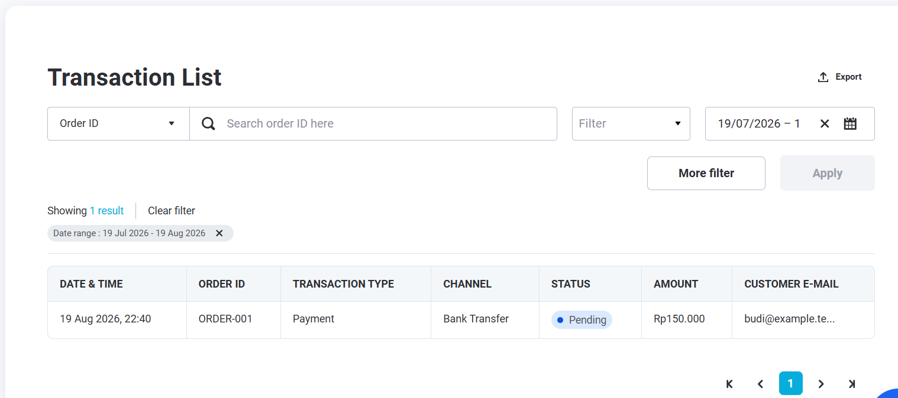

# Repository B - Laravel 8 Midtrans API

REST API ini mengintegrasikan **Payment Gateway Midtrans** dengan **Charge Transaction API** dan **webhook notifikasi pembayaran**. Setiap transaksi disimpan ke database melalui model `PaymentTransaction` sehingga status pembayaran selalu tercatat dan dapat ditelusuri.

## Fitur

- Charge Transaction melalui Midtrans API (bank transfer, kartu kredit, dan metode pembayaran lain).
- Verifikasi notifikasi webhook Midtrans menggunakan `signature_key` (SHA512).
- Pemetaan status transaksi otomatis: `pending`, `success`, `failed`, `challenge`, `refunded`.
- Penyimpanan payload charge & notifikasi lengkap ke database.
- CORS aktif untuk kebutuhan integrasi lintas domain.

## Teknologi

| Teknologi | Versi |
|-----------|-------|
| Laravel | ^8.83 |
| PHP | ^7.3 \| ^8.0 |
| GuzzleHTTP | ^7.0.1 |

## Persyaratan

- PHP 7.3+ dengan ekstensi yang dibutuhkan Laravel 8
- Composer
- MySQL / PostgreSQL / SQLite
- Akun Midtrans (Sandbox atau Production)

## Instalasi

```bash
composer install
cp .env.example .env   # atau copy .env.example .env di Windows
php artisan key:generate
php artisan migrate
php artisan serve
```

## Konfigurasi

Isi konfigurasi berikut di file `.env`:

```env
MIDTRANS_IS_PRODUCTION=false
MIDTRANS_SERVER_KEY=SB-Mid-server-xxxxx
MIDTRANS_CLIENT_KEY=SB-Mid-client-xxxxx
```

> Gunakan `MIDTRANS_IS_PRODUCTION=true` beserta `Mid-server-xxxxx` ketika sudah siap untuk production.

## Endpoint

| Method | Endpoint | Deskripsi |
|--------|----------|-----------|
| `POST` | `/api/payments/midtrans/charge` | Membuat transaksi charge ke Midtrans |
| `POST` | `/api/payments/midtrans/webhook` | Menerima notifikasi pembayaran dari Midtrans |
| `GET` | `/api/payments/midtrans/transactions/{orderId}` | Melihat detail transaksi berdasarkan order ID |

## Contoh Penggunaan

### 1. Charge Transaction

```http
POST /api/payments/midtrans/charge
Content-Type: application/json
```

```json
{
  "payment_type": "bank_transfer",
  "bank_transfer": {
    "bank": "bni"
  },
  "transaction_details": {
    "order_id": "ORDER-001",
    "gross_amount": 150000
  },
  "customer_details": {
    "first_name": "Budi",
    "email": "budi@example.test",
    "phone": "08123456789"
  }
}
```

**Response (contoh):**

```json
{
  "message": "Midtrans charge transaction processed.",
  "data": {
    "order_id": "ORDER-001",
    "gross_amount": "150000.00",
    "status": "pending",
    "status_code": "201",
    "transaction_status": "pending",
    "payment_type": "bank_transfer",
    "midtrans_transaction_id": "1e8f2d7c-...",
    "paid_at": null,
    "failed_at": null
  },
  "midtrans": { }
}
```

### 2. Webhook Midtrans

Daftarkan URL berikut di **Midtrans Sandbox Dashboard**:

```text
https://domain-anda.com/api/payments/midtrans/webhook
```

Lokasi dashboard:

```text
https://dashboard.sandbox.midtrans.com/settings/payment/notification
```

Webhook memverifikasi `signature_key` dengan format resmi Midtrans:

```text
SHA512(order_id + status_code + gross_amount + MIDTRANS_SERVER_KEY)
```

Jika signature tidak valid, API mengembalikan `403`.

### 3. Lihat Detail Transaksi

```http
GET /api/payments/midtrans/transactions/ORDER-001
```

## Pemetaan Status

| Status Lokal | Kondisi dari Midtrans |
|--------------|-----------------------|
| `success` | `transaction_status` = `settlement` / `capture`, dan `fraud_status` kosong atau `accept` |
| `pending` | Transaksi masih menunggu pembayaran |
| `failed` | `transaction_status` = `deny`, `cancel`, `expire`, atau `failure` |
| `challenge` | Kartu `capture` dengan `fraud_status` = `challenge` |
| `refunded` | Refund atau chargeback |

## Screenshot Sistem

### Data Transaksi di Database


